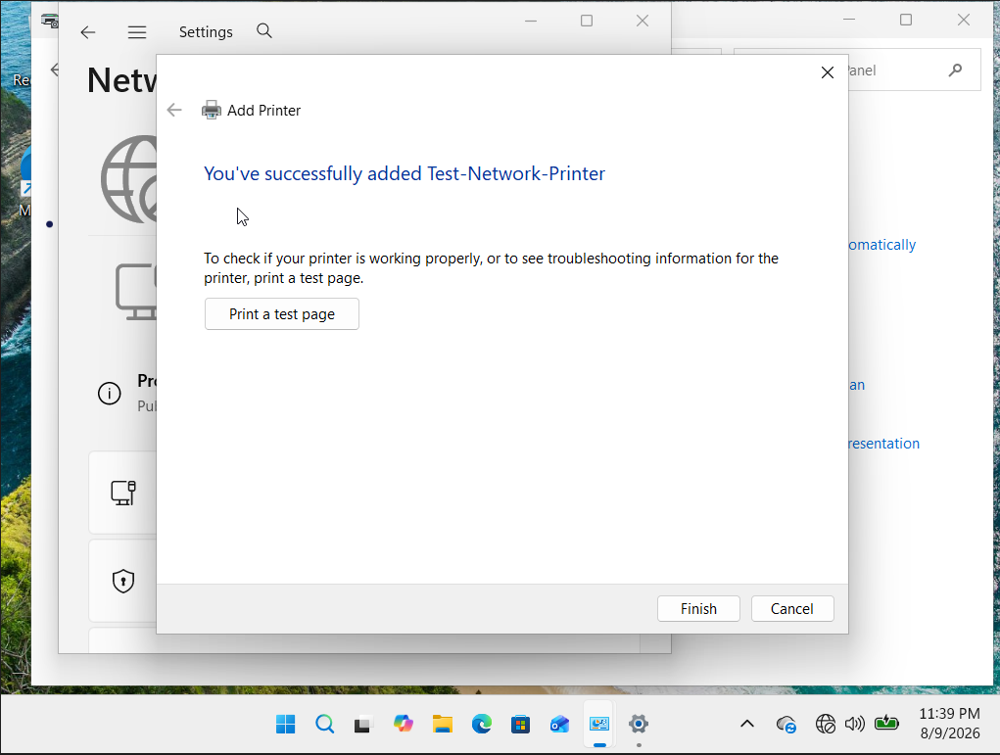

# Printers - Key Facts

## 7 Steps of Laser Printing (exam and interview)
1. Processing — print job received and processed
2. Charging — drum given uniform negative charge
3. Exposing — laser draws image, neutralising charge
4. Developing — toner attaches to exposed areas
5. Transferring — toner moves from drum to paper
6. Fusing — heat and pressure bonds toner to paper
7. Cleaning — residual toner removed from drum

## Common Printer Problems and Fixes
Printer offline → check connection, restart Print Spooler
Paper jam → clear gently following arrows, check for torn pieces
Faded print → shake/replace toner cartridge
Smearing toner → fuser unit failing, replace fuser
Lines on output → dirty drum, replace drum unit
Printer not found → ping printer IP, check port 9100 or 515

## Fix for stuck print queue
net stop spooler
del /Q /F /S "%systemroot%\System32\spool\PRINTERS\*.*"
net start spooler

## How to add a network printer
Control Panel → Devices and Printers → Add printer
→ Add by TCP/IP address → enter printer IP

## Defend question: "A user says their document is stuck in the print queue and won't print or cancel. What do you do?"

## Answer out loud: Open services.msc, stop the Print Spooler, navigate to C:\Windows\System32\spool\PRINTERS, delete all files in that folder, restart the Print Spooler. The stuck job is gone. If the printer still won't print after that — ping the printer IP to verify it's online, check the port configuration in printer properties.

## Screenshots
