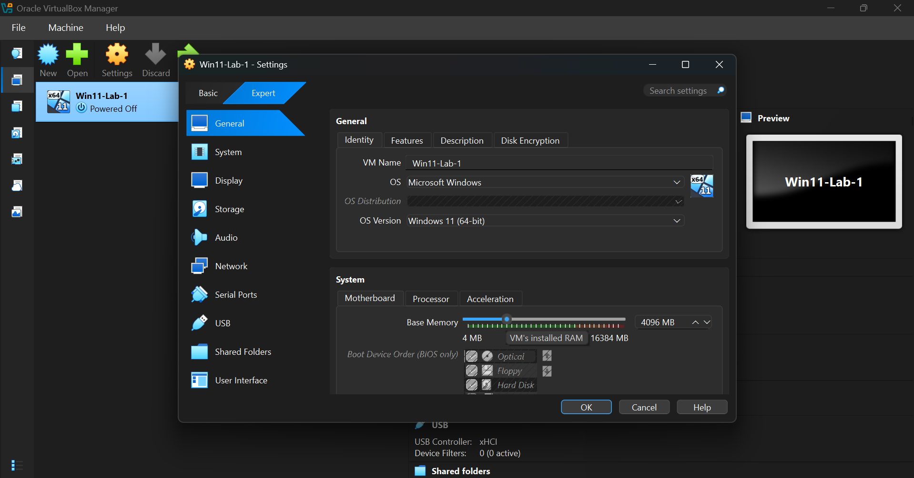

# Lab-002 — RAM Simulation and Windows Boot Failure

## Date
27 July 2026

## Goal
Simulate a RAM-related startup failure by reducing the amount of memory allocated to a Windows 11 virtual machine and observe how Windows behaves when insufficient memory is available.

## Environment
- Host OS: Windows 11
- Hypervisor: Oracle VirtualBox
- Guest OS: Windows 11
- VM Name: Win11-Lab1
- Initial RAM: 4096 MB
- Test RAM: 512 MB

---

# Test 1 — Normal RAM Behaviour

## Objective
Observe how Windows uses RAM during normal operation.

## Procedure
1. Started the virtual machine.
2. Opened **Task Manager → Performance → Memory**.
3. Opened multiple browser tabs and applications.
4. Monitored memory usage in real time.
5. Closed the applications and observed memory usage decrease.

## Observations
- RAM usage increased as additional applications were opened.
- Memory usage decreased after closing applications.
- Windows dynamically allocated and released RAM as expected.

---

# Test 2 — Simulating Insufficient RAM

## Objective
Determine how Windows behaves when the available memory is below the minimum required to boot.

## Procedure
1. Powered off the virtual machine.
2. Reduced the allocated memory from **4096 MB** to **512 MB**.
3. Started the virtual machine.

## Symptoms Observed
The virtual machine failed to boot and displayed the Windows Recovery screen.

**Error code:** `0xC0000017`

**Message:**
> "There isn't enough memory available to create a RAMDISK device."

Windows could not boot into the operating system or the recovery environment.

## Root Cause
The virtual machine was allocated only **512 MB** of RAM, which is below the minimum memory required for Windows 11 to initialize the operating system.

Because there was insufficient memory available, Windows could not create the RAMDISK required during startup, causing the boot process to fail.

## Fix Applied
1. Powered off the virtual machine.
2. Increased the allocated RAM back to **4096 MB**.
3. Restarted the virtual machine.

## Verification
- Windows booted successfully.
- The Recovery screen no longer appeared.
- The operating system loaded without errors.

## How I Would Explain This to a User
> "Your computer is unable to start because Windows doesn't have enough available memory to complete the startup process. I'll first check whether the memory is being detected correctly and then determine whether the issue is caused by a hardware fault or an incorrect system configuration."

## What I Would Check on a Real PC
1. Ask whether any hardware changes were recently made.
2. Reseat the RAM modules.
3. Test one RAM stick at a time.
4. Test different motherboard RAM slots.
5. Verify the installed memory in the BIOS.
6. Run Windows Memory Diagnostic (`mdsched.exe`).
7. Check for hardware compatibility issues.

## Lessons Learned
- Windows requires sufficient memory before the operating system can load.
- Error **0xC0000017** commonly indicates that Windows cannot allocate enough memory during startup.
- Always verify hardware or VM configuration before troubleshooting software.
- A structured troubleshooting process helps isolate the root cause more efficiently.

## Screenshots

