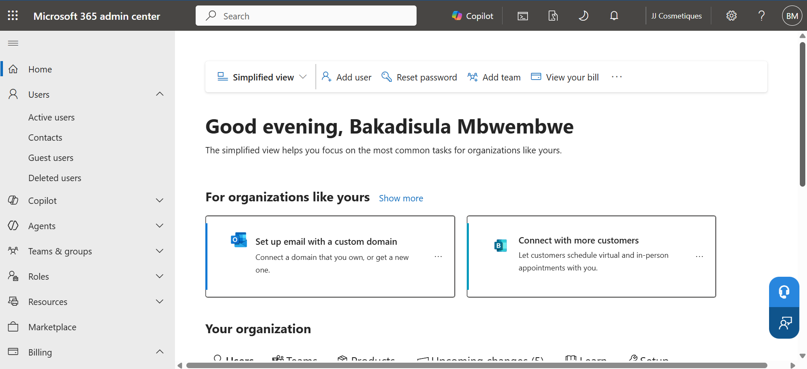
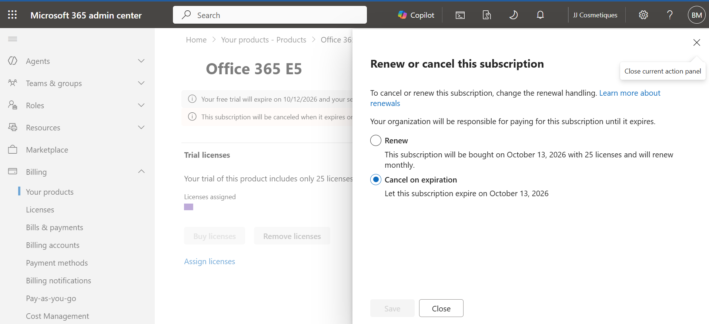
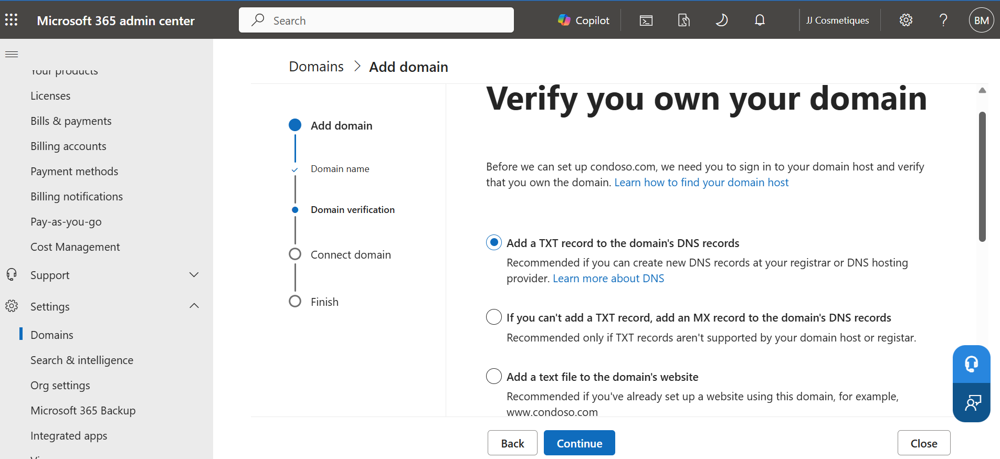

# Lab 001 — Tenant Setup and DNS Configuration

**Date:** 12 August 2026
**Day:** 01 of 30-day MD-102 plan

---

## Goal

Set up and access a Microsoft 365 E5 trial tenant and begin exploring the Microsoft 365 administration environment, tenant domains and DNS configuration.

---

## Environment

* Microsoft 365 E5 trial
* Windows 11
* Microsoft Edge / Chrome
* Microsoft 365 admin center: `admin.microsoft.com`
* Microsoft Entra admin center: `entra.microsoft.com`
* Command Prompt
* `nslookup`

---

## Steps I Took

1. Started a Microsoft 365 E5 free trial for IT support and MD-102 lab practice.

2. Signed in using the Microsoft account used during the Microsoft 365 setup.

3. Accessed the Microsoft 365 admin center.

4. Confirmed that I could access the Microsoft 365 administration environment.

5. Located the tenant's default Microsoft domain:
   `[yourtenant].onmicrosoft.com`

6. Opened the Microsoft 365 admin center and explored the available administration sections.

7. Navigated to **Settings → Domains**.

8. Viewed the domain associated with the tenant.

9. Studied how Microsoft 365 handles custom domains.

10. Reviewed the DNS records Microsoft 365 can require when connecting a custom domain.

11. Identified the main DNS record types:

    * MX
    * TXT
    * CNAME
    * SRV

12. Opened Command Prompt and used `nslookup` to query public DNS records.

13. Ran:

```text
nslookup -type=MX outlook.com
```

14. Ran:

```text
nslookup -type=TXT outlook.com
```

15. Ran:

```text
nslookup -type=CNAME autodiscover.outlook.com
```

16. Observed the DNS responses and compared the different record types.

17. Explored the Microsoft 365 admin center to become familiar with where tenant administration tasks are performed.

18. Checked the trial's billing settings and disabled recurring billing so that the trial does not automatically renew into a paid subscription.

19. Saved screenshots of the tenant, domain settings and billing/recurring-billing status for my lab documentation.

---

## Commands Used

```text
nslookup -type=MX outlook.com
nslookup -type=TXT outlook.com
nslookup -type=CNAME autodiscover.outlook.com
```

---

## What Broke

* [Write anything that actually went wrong.]

**Nothing significant broke during the initial tenant setup. The main challenge was understanding where the different Microsoft 365 administration and DNS settings are located.**

---

## How I Fixed It

[Only document an actual problem and how you solved it.]

If nothing broke:

**No technical issue required fixing during this lab. I used Microsoft Learn to understand the DNS configuration process and explored the relevant admin center sections.**

---

## Screenshots





---

## Lessons Learned

I learned that the Microsoft 365 tenant is the central environment where an organisation's Microsoft cloud services are managed.

I also learned that connecting a custom domain is more than simply entering the domain into Microsoft 365. Microsoft needs to verify ownership and then provides the DNS records required for the services I want to use.

The DNS records are managed through the domain's DNS hosting provider. Microsoft 365 can tell me what records are required, and then Microsoft verifies those records after they are created.

For email, the MX record is particularly important because it determines where mail for the domain is delivered.

I also learned how `nslookup` can be used from the command line to investigate DNS problems.

---

## Exam Connection

This lab gives me practical experience with Microsoft 365 administration and DNS concepts that are relevant to Microsoft 365 administration and troubleshooting.

I need to remember:

* MX → mail delivery
* TXT → domain verification / SPF information
* CNAME → alias/service configuration
* SRV → service location

I also need to understand the difference between the Microsoft 365 admin center showing me the required DNS records and the DNS provider actually hosting those records.

---

## Real Job Connection

If a company moves its email to Microsoft 365, I may need to troubleshoot problems caused by incorrect DNS configuration.

For example, if users suddenly stop receiving email, I can check the domain's MX record to see whether mail is still being directed to the correct mail provider.

I can use `nslookup` as a quick diagnostic tool before escalating the problem.

This is useful in an IT support environment because I can verify whether the problem is with the user's computer or with the organisation's DNS/email configuration.
