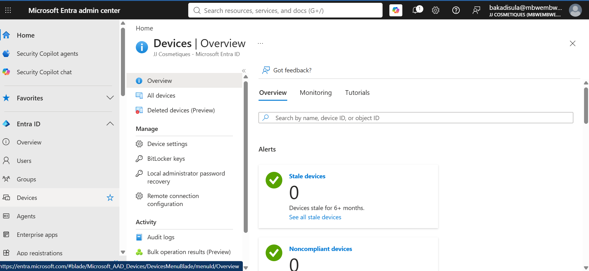
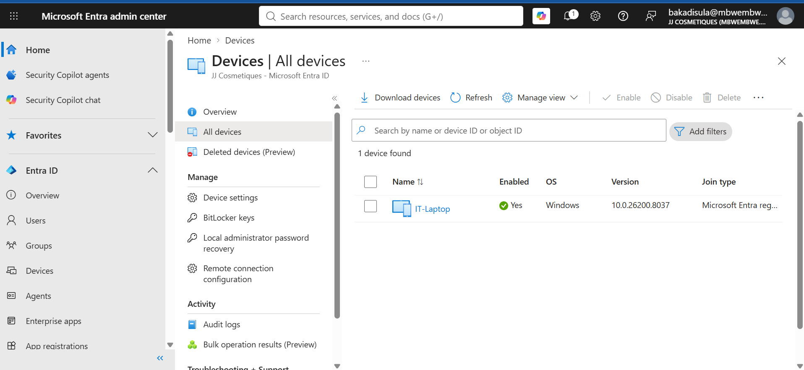
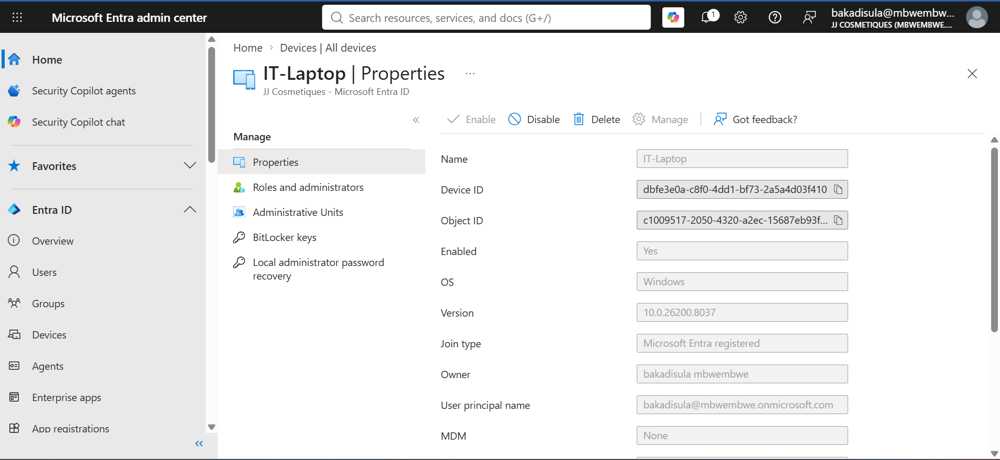
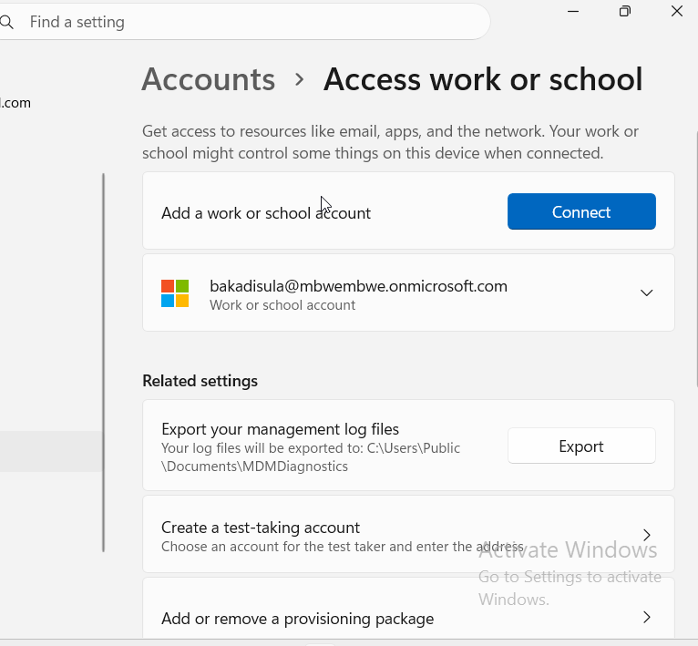

# Lab 006 — Entra ID Device Registration

Date: 13 August 2026
Day: 06 of 30-day MD-102 plan

==================================================
GOAL
==================================================

Register a Windows 10 VM with Microsoft Entra ID and examine
what information is visible in Entra ID and Microsoft Intune.

The main objective is to understand the difference between
device identity in Entra ID and device management in Intune.

==================================================
ENVIRONMENT
==================================================

- Windows 10 Lab VM
- Win10-Lab1
- Microsoft 365 E5 tenant
- Microsoft Entra admin center
- Microsoft Intune admin center
- M365 tenant administrator account

==================================================
TASK 1 — REGISTER THE DEVICE
==================================================

1. Opened Windows Settings.

2. Navigated to:

Settings
→ Accounts
→ Access work or school

3. Selected:

Connect

4. Signed in using my Microsoft 365 tenant account.

5. Completed the connection process.

Result:

The Windows VM was connected to my organisation's Microsoft
Entra environment.

The purpose of this exercise was to register the device rather
than perform a full Entra ID Join.

==================================================
TASK 2 — CHECK THE DEVICE IN ENTRA ID
==================================================

1. Opened:

entra.microsoft.com

2. Navigated to:

Devices
→ All devices

3. Located Win10-Lab1.

4. Opened the device record.

I checked the available device information.

Information observed:

- Device name
- Device ID
- Operating system
- OS version
- Join type
- Device ownership/information where available
- Last activity/last seen information
- Compliance information where available

Join type shown:

[Record exactly what your tenant shows.]

==================================================
TASK 3 — DEVICE INFORMATION IN ENTRA ID
==================================================

The Entra ID device record provides identity-related
information about the device.

==================================================
TASK 4 — CHECK THE DEVICE IN INTUNE
==================================================

1. Opened the Microsoft Intune admin center.

2. Navigated to:

Devices
→ All devices

3. Located Win10-Lab1.

4. Opened the device record.

I compared the information shown by Intune with the information
shown by Entra ID.

==================================================
ENTRA ID VS INTUNE
==================================================

Entra ID primarily provided information about the device's
identity and relationship with the organisation.

Intune provided additional information related to device
management.

Examples of information available in Intune included:

- Management status
- Compliance state
- Device ownership
- Configuration/policy information
- Security management information
- Applications
- Device management details

==================================================
COMPARISON
==================================================

| Entra ID | Intune |
|----------|--------|
| Device identity | Device management |
| Device ID | Management status |
| Join/registration state | Compliance |
| OS information | Policies |
| User/device relationship | Applications |
| Last activity | Configuration/security status |

Important distinction:

Entra ID answers:

"Who/what is this device and how is it connected to the
organisation?"

Intune answers:

"How is this device being managed and is it meeting the
organisation's requirements?"

==================================================
WHAT I OBSERVED
==================================================

Entra ID showed the device's identity and registration/join
information.

Intune provided additional device-management information.

This demonstrated that Entra ID and Intune work together but
serve different purposes.

==================================================
WHAT BROKE
==================================================

[Record anything that actually failed.]

If nothing failed:

Nothing broke during the device registration exercise.

==================================================
HOW I FIXED IT
==================================================

[Record any troubleshooting performed.]

If nothing failed:

No corrective action was required.

==================================================
SCREENSHOTS
==================================================

==================================================
LESSONS LEARNED
==================================================

I learned that Entra ID and Intune are related but have
different responsibilities.

Entra ID provides the identity layer for devices and users.

Intune provides device-management capabilities.

I also learned that the type of device connection matters.

Registered devices are commonly personal/BYOD devices, while
Entra Joined devices are commonly corporate devices that need
stronger organisational control.

==================================================
EXAM CONNECTION
==================================================

This lab reinforces:

- Microsoft Entra ID device registration
- Entra ID Registered
- Entra ID Joined
- Hybrid Entra ID Joined
- Device identity
- Device ownership
- Microsoft Intune
- Device compliance
- Device management
- Cloud-first device management
- BYOD scenarios

==================================================
REAL JOB CONNECTION
==================================================

In a real organisation, I may need to determine how a user's
device is connected to Microsoft Entra ID before troubleshooting
an access or management problem.

For example:

Personal device
    ↓
Entra ID Registered
    ↓
Limited organisational control

Corporate device
    ↓
Entra ID Joined
    ↓
Stronger management through Intune

Existing AD organisation
    ↓
Hybrid Entra ID Joined
    ↓
On-premises AD + Microsoft cloud

Understanding this helps me choose the correct troubleshooting
and management approach for the device.