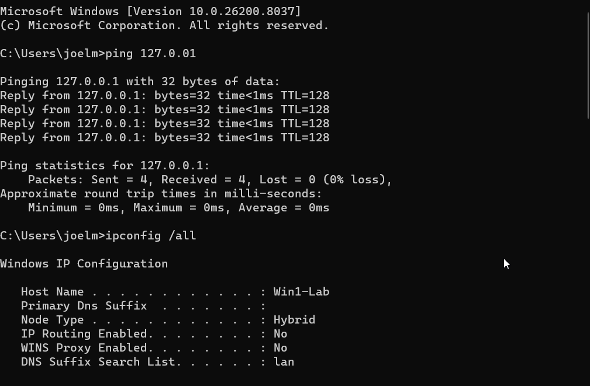
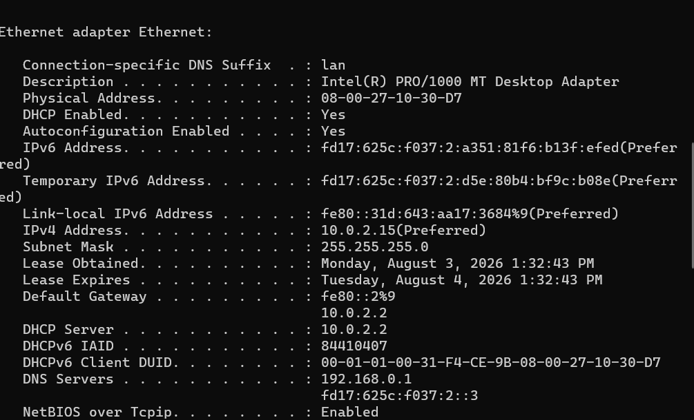
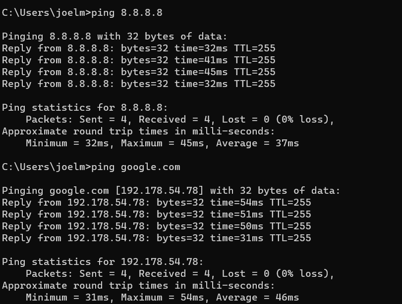
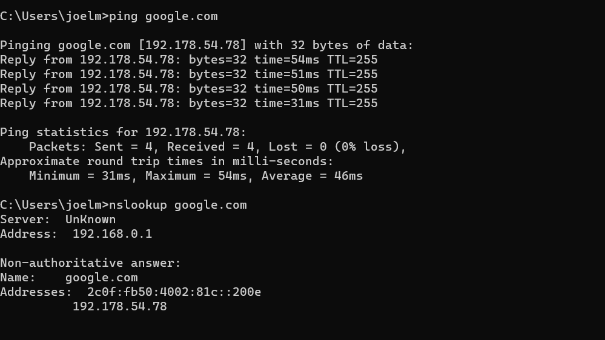

# Lab-001 — Verifying Basic Network Connectivity and DNS Resolution

## Date
3 August 2026

## Goal
Verify that the Windows networking stack is functioning correctly by testing the TCP/IP stack, checking the network configuration, confirming Internet connectivity, and validating DNS name resolution.

## Environment
- Host OS: Windows 11
- Hypervisor: Oracle VirtualBox
- Guest OS: Windows 11
- VM Name: Win11-Lab1
- Network Adapter: Intel(R) PRO/1000 MT Desktop Adapter (NAT)
- DHCP: Enabled

--- 

# Test 1 — Verifying the TCP/IP Stack

## Objective
Confirm that the Windows TCP/IP stack is functioning correctly using the loopback address.

## Procedure
Opened Command Prompt.
Ran:
ping 127.0.0.1

## Observations
All four ICMP echo requests received replies.
0% packet loss.
Response time was less than 1 ms.
Result

The local TCP/IP stack was functioning correctly.

---

# Test 2 — Checking Network Configuration

## Objective
Verify that the virtual machine received a valid network configuration.

## Procedure
Ran:
ipconfig /all
Reviewed the assigned network settings.

## Observations
IPv4 Address: 10.0.2.15
Subnet Mask: 255.255.255.0
Default Gateway: 10.0.2.2
DHCP Enabled: Yes
DNS Server: 192.168.0.1

The VM successfully obtained its network configuration from DHCP.

---

# Test 3 — Testing Internet Connectivity

## Objective
Verify connectivity to an external IP address.

## Procedure
Ran:
ping 8.8.8.8

## Observations
All four packets were received.
0% packet loss.
Average latency approximately 37 ms.
Result

The VM successfully communicated with an external host, confirming Internet connectivity.

---

# Test 4 — Testing DNS Name Resolution

## Objective
Verify that DNS can successfully resolve hostnames into IP addresses.

## Procedure
Ran:
ping google.com
Ran:
nslookup google.com

## Observations
The hostname google.com successfully resolved to an IP address.
ping returned successful replies.
nslookup returned both IPv4 and IPv6 addresses.
Result

DNS name resolution was functioning correctly.

Summary of Findings
Test	Status
TCP/IP Stack	✅ Passed
Network Configuration	✅ Passed
Internet Connectivity	✅ Passed
DNS Resolution	✅ Passed

## How I Would Explain This to a User

>"I verified that your computer's network adapter is receiving a valid IP address, it can communicate with the local network, reach the Internet, and successfully translate website names into IP addresses. At this stage, the basic network connection is working normally."

## What I Would Check on a Real PC

1. Verify the Ethernet cable or Wi-Fi connection.
2. Confirm the network adapter is enabled.
3. Check the IP configuration using ipconfig /all.
4. Test the TCP/IP stack with ping 127.0.0.1.
5. Test the default gateway.
6. Test Internet connectivity using ping 8.8.8.8.
7. Verify DNS resolution using nslookup.
8. Restart the network adapter or renew the DHCP lease if necessary.

## Lessons Learned
- The loopback address (127.0.0.1) verifies the local TCP/IP stack.
- ipconfig /all displays detailed network configuration information.
- Successfully pinging 8.8.8.8 confirms Internet connectivity independent of DNS.
- ping google.com verifies both Internet connectivity and DNS resolution.
- nslookup confirms that the configured DNS server can resolve domain names.
- Performing these tests in sequence provides a structured approach to diagnosing network connectivity issues.

## Screenshots

