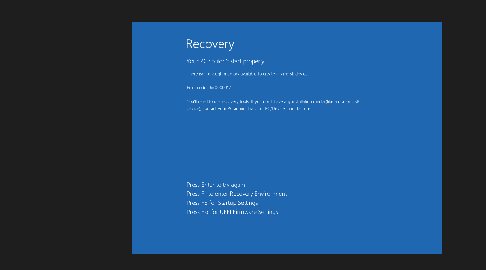

# TJ-002 — Windows Boot Failure Due to Insufficient RAM

## Environment
- Host OS: Windows 11
- Hypervisor: Oracle VirtualBox
- VM: Win11-Lab1
- Assigned RAM: 512 MB (reduced from 4096 MB)

## Symptom
The virtual machine failed to boot and displayed the Windows Recovery screen.

**Error code:** `0xC0000017`

**Error message:**
> "There isn't enough memory available to create a RAMDISK device."

Windows could not boot into the operating system or the recovery environment.

## Initial Theory
The VM did not have enough RAM allocated for Windows to initialize the boot process and create the required RAMDISK.

## Was the Theory Correct?
**Yes.**

Restoring the VM's memory allocation resolved the issue immediately.

## Troubleshooting Steps
1. Reviewed the Windows Recovery error message.
2. Confirmed the VM was configured with only **512 MB** of RAM.
3. Compared the allocated memory against Windows 11 minimum memory requirements.
4. Increased the VM memory allocation back to **4096 MB**.
5. Restarted the virtual machine.

## Root Cause
The VM was configured with insufficient RAM. Windows requires significantly more memory than 512 MB to initialize the operating system and the recovery environment.

## Fix
Restored the VM's memory allocation from **512 MB** to **4096 MB**.

## Verification
- VM booted successfully.
- Windows loaded normally.
- No further recovery errors were displayed.

## What I'd Check First Next Time
- Verify the VM's RAM allocation before troubleshooting software issues.
- Check whether any recent hardware or VM configuration changes were made.
- Confirm that the assigned memory meets Windows minimum requirements.

## Real-World Connection
On a physical computer, this error could indicate:
- A faulty RAM module.
- A loose RAM stick.
- Incorrect BIOS memory configuration.
- Insufficient usable memory due to a hardware failure.

In a real support environment, I would reseat the RAM, test each memory module individually, verify the BIOS detects the installed memory correctly, and run Windows Memory Diagnostic if the system can boot.

## Screenshots

