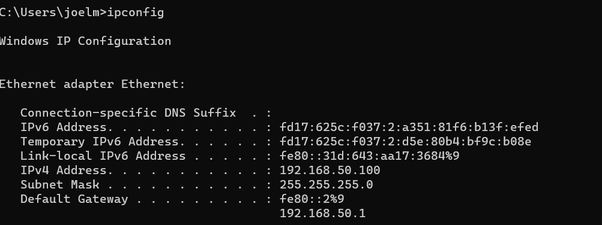
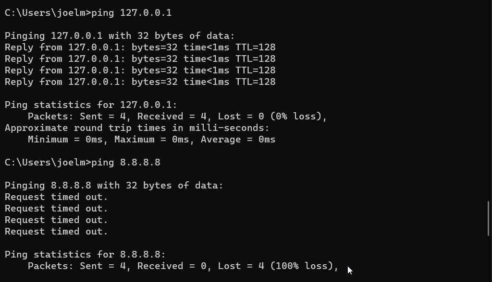
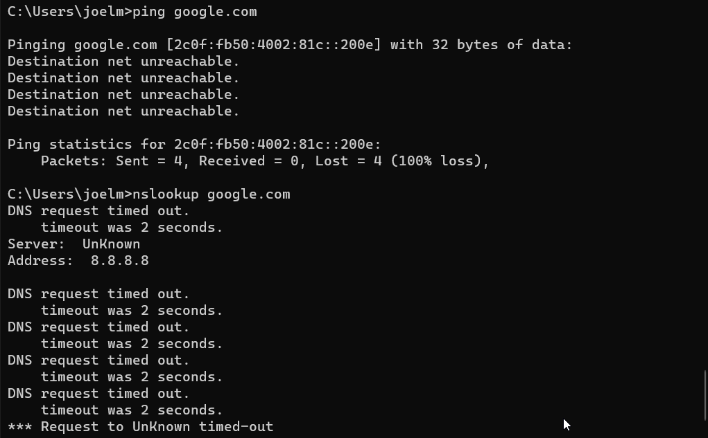
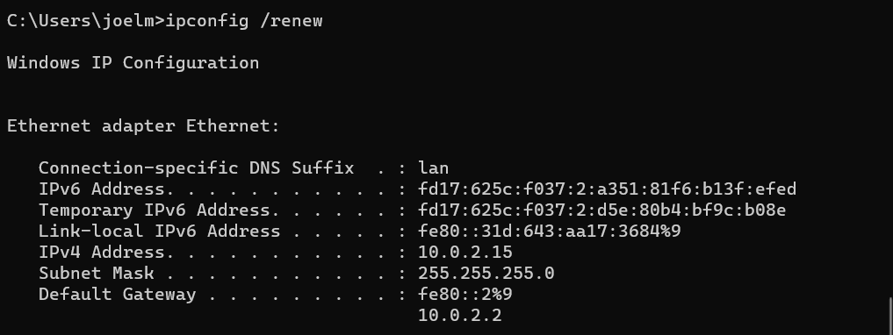

# TJ-003 — Network Connectivity Failure Due to Incorrect Static IP Address

## Environment

Host OS: Windows 11
Hypervisor: Oracle VirtualBox
Guest OS: Windows 11
VM: Win11-Lab1
Network Adapter: Intel(R) PRO/1000 MT Desktop Adapter (NAT)
IP Configuration: Manually configured with an incorrect static IP address

## Symptom
The virtual machine could not communicate with the network or access the Internet.

## Observed behaviour:
ping 127.0.0.1 succeeded.
ping 8.8.8.8 failed.
ping google.com failed.
Network resources were inaccessible.

## Initial Theory
The network adapter was configured with an incorrect IP address or default gateway, preventing communication outside the local computer.

## Was the Theory Correct?
Yes.

The incorrect static IP configuration prevented the VM from communicating with the VirtualBox NAT network.

## Troubleshooting Steps
- Ran ipconfig /all to review the network configuration.
- Confirmed the VM was using a manually configured static IP.
- Compared the configured IP settings with the expected VirtualBox NAT network.
- Changed the adapter back to Obtain an IP address automatically (DHCP).
- Renewed the IP configuration.
- Retested network connectivity.

## Root Cause
The VM was configured with an incorrect static IP address and gateway that did not belong to the VirtualBox NAT network.

## Fix
Enabled DHCP.
Renewed the IP address.
Verified the VM received a valid IP configuration.
Verification
ping 127.0.0.1 succeeded.
ping 8.8.8.8 succeeded.
ping google.com succeeded.
Internet connectivity was restored.

## What I'd Check First Next Time
Verify whether DHCP or static addressing is expected.
Check the assigned IP address.
Verify the subnet mask.
Verify the default gateway.
Compare the configuration with other working devices.

## Real-World Connection
A user may accidentally configure an incorrect static IP address or gateway, resulting in loss of network connectivity. In a business environment, I would verify the addressing scheme, compare it with DHCP settings, and restore the correct configuration.

## Screenshots

