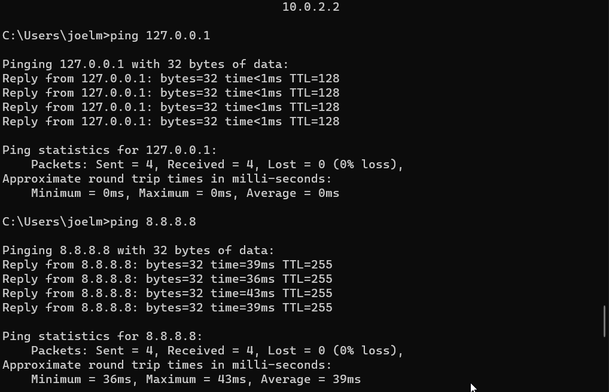
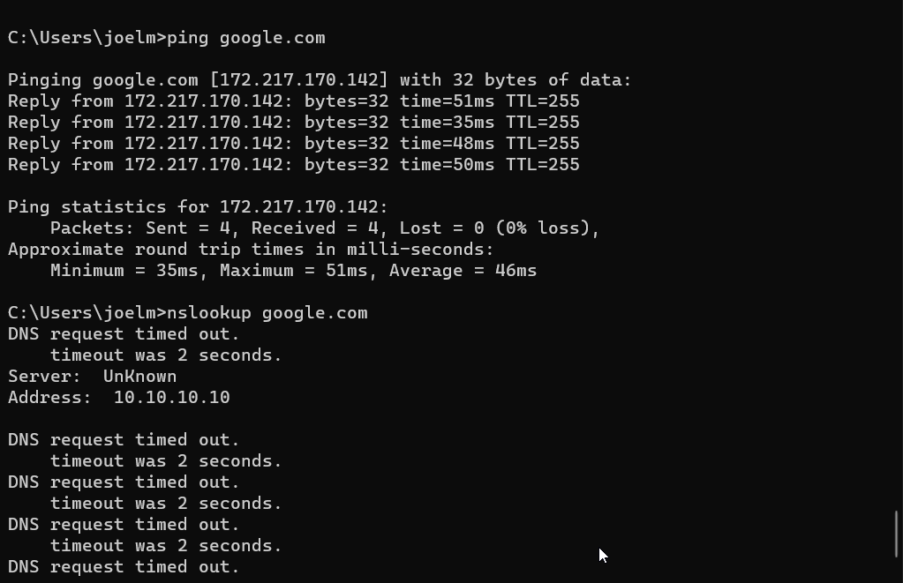

# TJ-006 — DNS Resolution Failure Due to Incorrect DNS Server

## Environment

Host OS: Windows 11
Hypervisor: Oracle VirtualBox
Guest OS: Windows 11
VM: Win11-Lab1
Network Adapter: Intel(R) PRO/1000 MT Desktop Adapter (NAT)
DNS Server: Manually configured with an invalid address

## Symptom
The VM had Internet connectivity but could not access websites using hostnames.

## Observed behaviour:
ping 127.0.0.1 succeeded.
ping 8.8.8.8 succeeded.
ping google.com failed.
nslookup google.com failed.

## Initial Theory
The Internet connection was functioning correctly, but DNS name resolution was failing because of an incorrect DNS server configuration.

## Was the Theory Correct?
Yes.
Replacing the invalid DNS server restored hostname resolution immediately.

## Troubleshooting Steps

- Tested connectivity to an external IP address.
- Tested hostname resolution using ping google.com.
- Verified DNS resolution using nslookup.
- Reviewed the configured DNS server.
- Restored the DNS server to automatic configuration.
- Retested connectivity.

## Root Cause
The configured DNS server was unreachable and could not resolve domain names.

## Fix
Restored the DNS configuration to automatic (DHCP).
Verified the correct DNS server was assigned.
Verification
ping 8.8.8.8 succeeded.
ping google.com succeeded.
nslookup google.com returned valid records.

## What I'd Check First Next Time
Test an IP address before testing a hostname.
Verify the configured DNS server.
Confirm DNS settings using ipconfig /all.
Test DNS using nslookup.

# Real-World Connection
Incorrect DNS settings are a common cause of "the Internet is working but websites won't load." In a support environment, I would verify the configured DNS server, compare it with DHCP settings or organizational standards, and correct the configuration.

## Screenshots

